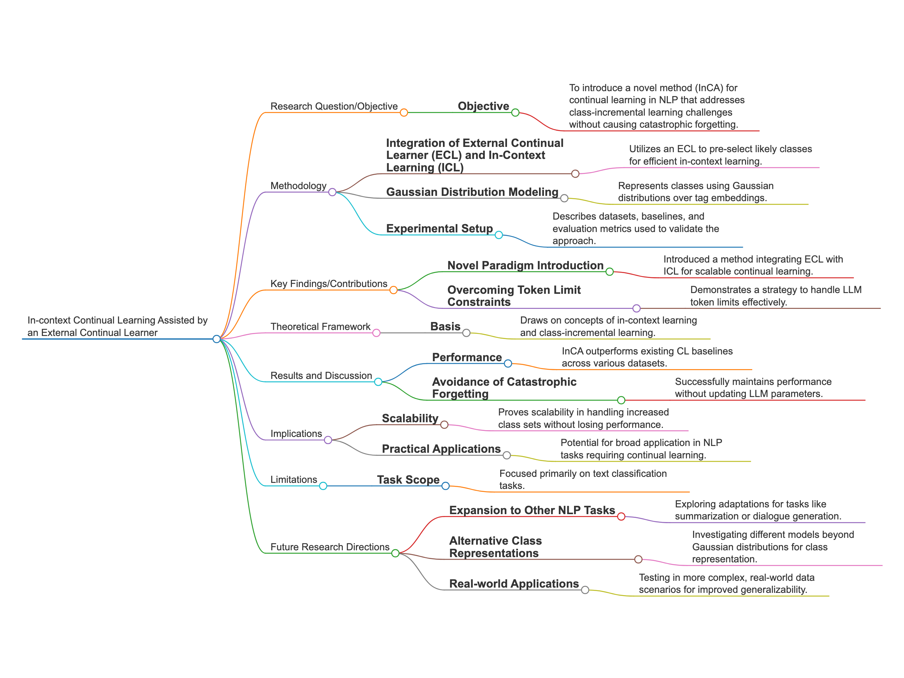

# Code for "In-context Continual Learning Assisted by an External Continual Learner"

Blog post <https://paperwithoutcode.com/in-context-continual-learning-assisted-by-an-external-continual-learner-no-more-rag/>

Saleh Momeni, Sahisnu Mazumder, Zixuan Ke, Bing Liu

The paper, “In-context Continual Learning Assisted by an External Continual Learner,” introduces an innovative methodological advancement in the realm of natural language processing (NLP), addressing persistent challenges in class-incremental learning (CIL) such as catastrophic forgetting (CF) and inter-task class separation (ICS). This study is particularly noteworthy for its novel integration of an external continual learner (ECL) with in-context learning (ICL) using large language models (LLMs), which pre-selects candidate classes through Gaussian distribution modeling. A key technical innovation is the use of Mahalanobis distance for class similarity measurements, which offers several advantages over traditional metrics like cosine similarity: it accounts for correlations between embedding dimensions through a shared covariance matrix, provides better handling of concept drift by considering the shape and orientation of class distributions, and enables more robust zero-shot generalization by capturing the statistical structure of class variations. This approach not only maintains model performance by efficiently managing LLM token limits but also circumvents CF entirely by eschewing parameter updates. The extensive empirical evidence presented demonstrates that InCA significantly outperforms current state-of-the-art methods, emphasizing its scalability and robustness across multiple benchmark datasets. The methodology encourages fresh perspectives on addressing scalability issues inherent to LLM context limitations. The use of Mahalanobis distance in conjunction with Gaussian class modeling provides a statistically sound foundation for handling evolving class distributions and adapting to changes in feature importance, making it particularly suitable for dynamic NLP environments. This paper stands out for its practical implications in effectively implementing continual learning in dynamic NLP environments and suggests further exploration into extending InCA’s applicability to diverse NLP tasks, optimizing class representations, and integrating minimal tuning strategies. This work represents a substantial contribution to the field, promising to reshape strategies for continual learning by leveraging innovative class management techniques.

