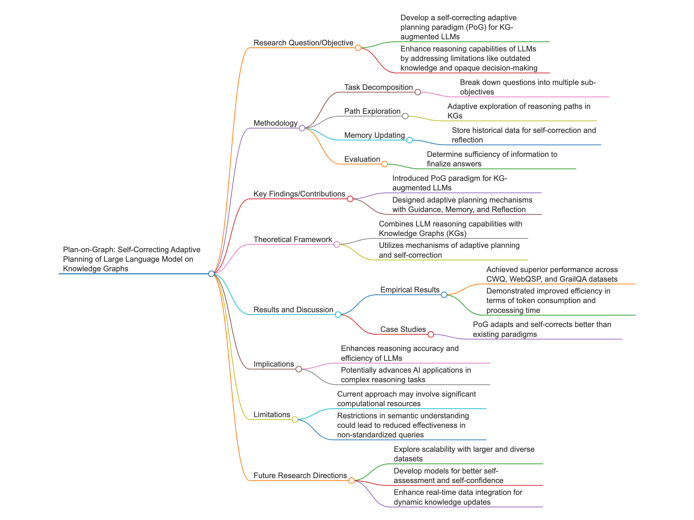

# PoC code for "Plan-on-Graph: Self-Correcting Adaptive Planning of Large Language Model on Knowledge Graphs"

Blog post <https://paperwithoutcode.com/plan-on-graph-self-correcting-adaptive-planning-of-large-language-model-on-knowledge-graphs-reflection-to-reason-in-agents/>

Liyi Chen, Panrong Tong, Zhongming Jin, Ying Sun, Jieping Ye, Hui Xiong

The research paper “Plan-on-Graph: Self-Correcting Adaptive Planning of Large Language Model on Knowledge Graphs” introduces a transformative approach for enhancing the reasoning capabilities of Large Language Models (LLMs) by integrating them with Knowledge Graphs (KGs). At the core of this work is the innovative Plan-on-Graph (PoG) paradigm, which introduces a reflection mechanism that allows LLMs to dynamically reconsider and adjust their reasoning paths. This novel framework addresses the limitations of existing KG-augmented LLMs, such as static path exploration and the inability to self-correct, by equipping LLMs with mechanisms for guidance, memory updating, and reflection. The result is a system that can efficiently handle complex queries by adaptively exploring and refining its reasoning processes, achieving superior accuracy and efficiency compared to prior models like ToG. The paper’s empirical results, validated across multiple datasets, underscore PoG’s effectiveness in reducing exploratory errors and resource use, setting a new standard in the field of AI reasoning tasks. This work offers a promising avenue for future research, including scalability studies and applications in diverse domains, and is a compelling read for those interested in advancing the capabilities of AI through enhanced reasoning methodologies. The authors have a placeholder repo <https://github.com/liyichen-cly/PoG> for future official code release. The demo code implements PoG’s core innovations: adaptive exploration, self-correction, and evidence-based reasoning through guidance, memory, and reflection mechanisms.

