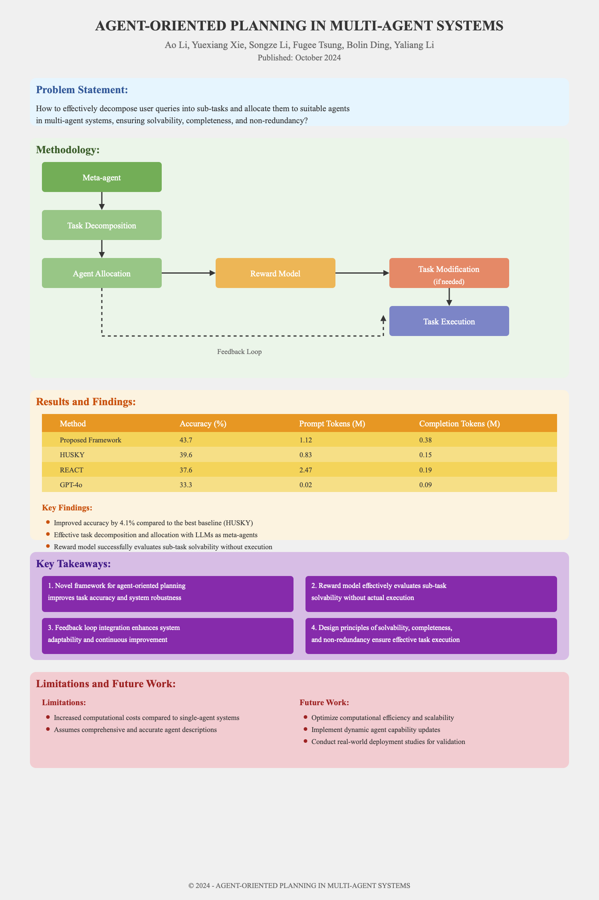

# Code for "Agent-Oriented Planning in Multi-Agent Systems"

Ao Li, Yuexiang Xie, Songze Li, Fugee Tsung, Bolin Ding, Yaliang Li

Blog post <https://paperwithoutcode.com/agent-oriented-planning-in-multi-agent-systems-build-your-perplexity-pro-agent/>

The paper “Agent-Oriented Planning in Multi-Agent Systems” introduces a groundbreaking framework that leverages large language models (LLMs) as meta-agents for efficient task decomposition and allocation within multi-agent systems. This research stands out due to its integration of a reward model that simulates and evaluates sub-task solvability without actual execution, vastly enhancing planning efficiency by aligning tasks with agent capabilities effectively. The framework’s design principles of solvability, completeness, and non-redundancy ensure robust resource management and comprehensive task handling. An innovative feedback loop allows the system to continuously adapt and improve, signaling its potential to revolutionize real-world applications by enhancing flexibility and sustainability. The meticulous empirical validation demonstrates significant advancements over traditional single-agent and existing multi-agent strategies, offering a promising new benchmark in the field. This approach not only optimizes task management but also provides a nuanced method for incorporating evolving capabilities of multi-agent systems. Future research could explore scalability enhancements, real-world deployment, and integration with next-generation LLMs to further advance this pioneering framework. The paper’s novel methodologies and comprehensive empirical insights make it a valuable read for researchers and graduate students interested in advancing multi-agent systems and AI planning. Code in this post illustrates a minimal implementation of this framework without using any other agent frameworks.

