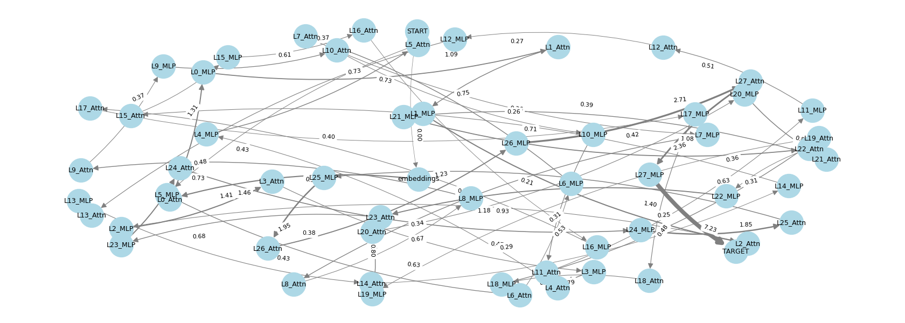

# PoC Code for “On the Biology of a Large Language Model”

In “Attribution Graphs” (2025), Olah et al. draw an analogy between neural circuits in biology and the flow of information through a transformer. Their core proposal is to trace and quantify how individual components—embeddings, attention heads, MLP blocks, and layers—contribute to a specific output. Rather than a monolithic importance score, they envision a graph whose nodes are components and whose edges capture the strength of influence passing from one node to the next, revealing the pathways by which a model arrives at its prediction.

## The code

This script prototypes the idea of "Attribution Graphs" with `Qwen/Qwen2.5-1.5B-Instruct` by:

1. Using Grad*Activation as a PROXY for the influence/contribution of specific component activations (embeddings, layer outputs) on a target output (predicted token logit).
2. Visualizing these scores as a DIRECTED GRAPH along the sequential forward pathway: embeddings → L0_attn → L0_mlp → L1_attn → L1_mlp → … → target.
3. Edge weights represent the calculated score of the SOURCE node, visualizing the influence magnitude flowing *out* along this path.

This is a simplification; true attribution graphs might involve more complex decomposition methods (e.g., path patching) to isolate direct contributions.

## Example run



```
Selected Device: MPS
Selected Dtype: float16
PyTorch version: 2.3.0

Loading tokenizer 'Qwen/Qwen2.5-1.5B-Instruct'...
Loading model 'Qwen/Qwen2.5-1.5B-Instruct' to MPS with float16...

--- Computing Attributions ---
Registering hooks...
  Hooked embeddings
  Hooking 28 transformer layers...
Registered 57 hooks successfully.
Running forward pass...
Running forward pass directly on MPS (autocast context manager skipped/unsupported for this device type)
Forward pass done. Predicted next token: ' a' (ID: 264)
Running backward pass...
Backward pass done.
Calculating Grad*Activation norms...
Attribution calculation finished (28.37s)

Cleaning up attribution resources...

--- Computed Attribution Scores (Grad*Activation Norms) ---
  embeddings          : 1.4647
  L0_Attn             : 1.3129
  L0_MLP              : 1.0940
  L1_Attn             : 0.7525
  L1_MLP              : 1.4049
  L2_Attn             : 0.3809
  L2_MLP              : 1.4058
  L3_Attn             : 0.4726
  L3_MLP              : 0.7922
  L4_Attn             : 0.3576
  L4_MLP              : 0.7313
  L5_Attn             : 0.3316
  L5_MLP              : 0.6318
  L6_Attn             : 0.3110
  L6_MLP              : 0.7322
  L7_Attn             : 0.3902
  L7_MLP              : 0.6671
  L8_Attn             : 0.3372
  L8_MLP              : 0.7266
  L9_Attn             : 0.3705
  L9_MLP              : 0.6098
  L10_Attn            : 0.3562
  L10_MLP             : 0.5339
  L11_Attn            : 0.3570
  L11_MLP             : 0.5117
  L12_Attn            : 0.2709
  L12_MLP             : 0.4752
  L13_Attn            : 0.4202
  L13_MLP             : 0.4339
  L14_Attn            : 0.2455
  L14_MLP             : 0.3994
  L15_Attn            : 0.3273
  L15_MLP             : 0.3668
  L16_Attn            : 0.2079
  L16_MLP             : 0.4315
  L17_Attn            : 0.2604
  L17_MLP             : 0.4843
  L18_Attn            : 0.3999
  L18_MLP             : 0.6294
  L19_Attn            : 0.2898
  L19_MLP             : 0.7965
  L20_Attn            : 0.4165
  L20_MLP             : 0.8224
  L21_Attn            : 0.7070
  L21_MLP             : 1.0772
  L22_Attn            : 0.3097
  L22_MLP             : 1.1755
  L23_Attn            : 0.6832
  L23_MLP             : 1.3073
  L24_Attn            : 0.9267
  L24_MLP             : 1.8493
  L25_Attn            : 0.7490
  L25_MLP             : 1.9467
  L26_Attn            : 1.2274
  L26_MLP             : 2.7126
  L27_Attn            : 2.3552
  L27_MLP             : 7.2283

```

## Interpreting the Results

* Node Scores (e.g. L27_MLP: 7.2283) are the L₂ norms of grad×activation.

* Higher ⇒ small perturbations at that node cause large changes in the final logit → strong proxy influence.

* Pathway Structure (embeddings → L0_Attn → L0_MLP → … → L27_MLP → TARGET)

* Shows the sequential flow of influence.

* Edge weights visualize how much “signal” each node passes forward.

## Key Takeaways for ML Researchers

Grad×Activation as a proxy: quick to compute, captures sensitivity along the main path.

Graph view: makes it easy to spot “hot” components (e.g. final MLP blocks) versus “cold” ones.

Next steps: use this as a guide for interventional methods (path patching) to confirm causal roles, or to inform pruning and interpretability analyses.