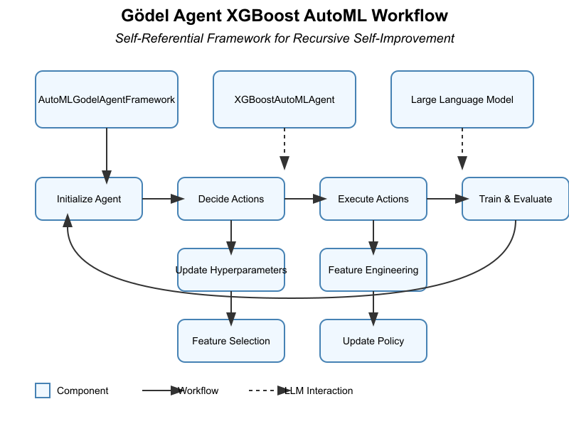

# Code of Gödel AutoML from "Gödel Agent: A Self-Referential Agent Framework for Recursive Self-Improvement"

Xunjian Yin, Xinyi Wang, Liangming Pan, Xiaojun Wan, William Yang Wang

Blog post <https://paperwithoutcode.com/godel-agent-a-self-referential-agent-framework-for-recursive-self-improvement-code-for-a-godel-automl-xgboost/>

The paper “GÖDEL AGENT: A SELF-REFERENTIAL FRAMEWORK FOR AGENTS RECURSIVELY SELF-IMPROVEMENT” marks a significant advancement in autonomous AI through its innovative application of the Gödel machine concept. By operationalizing Jürgen Schmidhuber’s theoretical framework via empirical feedback, the authors introduce the Gödel Agent, a self-referential system capable of continuous self-improvement without human-designed constraints. Utilizing large language models and the novel “monkey patching” technique, this agent dynamically modifies its runtime code, empowering it with authentic self-awareness and adaptiveness. The research demonstrates the agent’s superior performance across diverse tasks, notably surpassing manually designed and meta-learning optimized agents in flexibility and efficiency. The implications of this work are profound; it challenges traditional AI design paradigms by fully exploring autonomous design spaces, potentially leading to globally optimal solutions. Furthermore, the paper sets a trajectory for future research focused on enhancing optimization strategies, exploring collective intelligence, and ensuring safety and control as agents gain more autonomy. For researchers and graduate students, this paper is essential reading, offering groundbreaking methodologies and a vision for the next generation of self-improving AI systems. This post implemented a Gödel Agent of AutoML for xgboost models to self-improve with feature engineering and parameter tuning.

