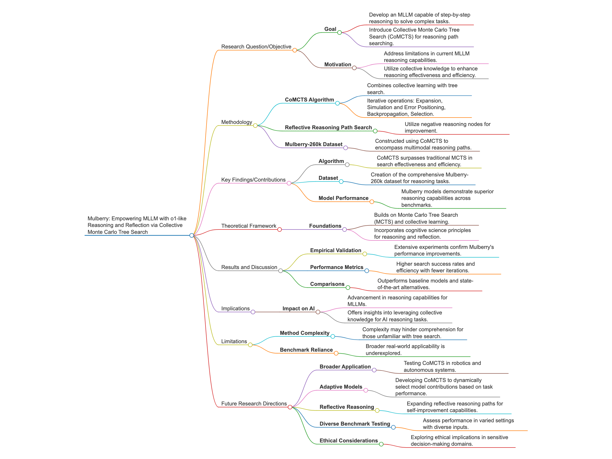

# Demo code for "Mulberry: Empowering MLLM with o1-like Reasoning and Reflection via Collective Monte Carlo Tree Search"

Blog post <https://paperwithoutcode.com/mulberry-empowering-mllm-with-o1-like-reasoning-and-reflection-via-collective-monte-carlo-tree-search/>

Huanjin Yao, Jiaxing Huang, Wenhao Wu, Jingyi Zhang, Yibo Wang, Shunyu Liu, Yingjie Wang, Yuxin Song, Haocheng Feng, Li Shen, Dacheng Tao

The research paper titled “Mulberry: Empowering MLLM with o1-like Reasoning and Reflection via Collective Monte Carlo Tree Search” presents a groundbreaking approach in the realm of artificial intelligence by integrating collective learning into tree search methods. The key highlight of the study is the introduction of the Collective Monte Carlo Tree Search (CoMCTS) algorithm, which significantly advances reasoning capabilities in multimodal large language models (MLLMs). By incorporating insights from multiple models, CoMCTS addresses traditional limitations in search effectiveness, enabling the dynamic construction of reasoning paths. This novel methodology is further supported by the creation of the Mulberry-260k dataset, designed to train and test models for explicit reasoning and reflection. The resulting Mulberry models demonstrate remarkable improvements over existing benchmarks, showcasing the power of ensemble learning in AI. The paper’s significance lies in its potential to transform AI problem-solving by promoting step-by-step reasoning akin to human thought processes, thereby setting a new standard for reasoning proficiency. Future research could explore CoMCTS’s applicability beyond MLLMs, investigate adaptive version developments, and assess its performance in diverse environments, potentially impacting areas such as autonomous decision-making and ethical AI applications. This work is essential reading for its innovative integration of collective intelligence and its implications for advancing AI model capabilities. The authors are preparing for their code release at <https://github.com/HJYao00/Mulberry> and this blog post implements a demo of number puzzle solver to illustrate the paper’s concept.

The Sequential Number Logic Puzzle implementation demonstrates the key innovations from the Mulberry paper by incorporating collective Monte Carlo Tree Search (CoMCTS) in a compact yet illustrative way. By simulating diverse model behaviors through different temperature settings (0.1, 0.5, 1.0 using gpt-4o-mini), it shows how collective knowledge can improve reasoning path exploration. The implementation includes step-by-step reasoning path generation, explicit constraint validation, and reflective analysis – directly mirroring the paper’s emphasis on o1-like step-by-step reasoning. The visualization of search trees and explicit reasoning paths helps illustrate how CoMCTS expands and evaluates nodes using collective knowledge, while the backpropagation mechanism shows how the algorithm learns from exploration outcomes.

