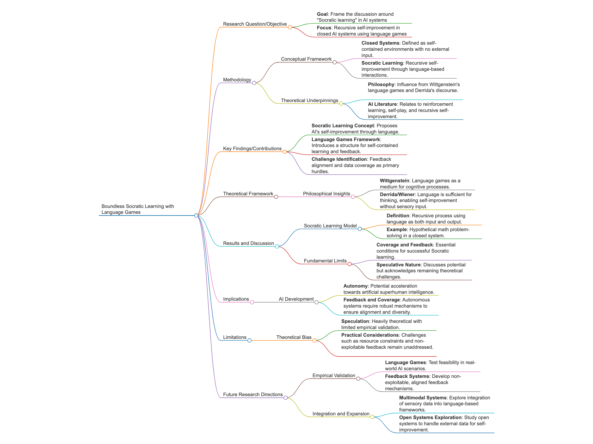

# Code for "Boundless Socratic Learning with Language Games"

Blog post <https://paperwithoutcode.com/boundless-socratic-learning-with-language-games-a-step-toward-agi-maybe/#mindmap>

Tom Schaul

The paper “Boundless Socratic Learning with Language Games” by Tom Schaul offers a fascinating theoretical exploration of recursive self-improvement in AI, proposing “Socratic learning” as a means for AI systems to enhance themselves through language-based dialogue within closed systems. This position paper is invaluable for those interested in the trajectory of artificial superhuman intelligence, as it challenges traditional dependencies on external data or human intervention by suggesting that AI could achieve significant advances autonomously. By drawing on philosophical insights from Wittgenstein and Derrida, Schaul emphasizes the potential of language games—structured interactions governed by rules—as a novel methodology to harness feedback and maintain data diversity in AI learning. Although the paper acknowledges the challenges of feedback alignment and data coverage as central concerns, it provides a speculative framework that invites further empirical study. Researchers and graduate students will find the proposed mechanisms intriguing for their potential to shift AI development paradigms significantly, pushing towards more autonomous systems. Future work could focus on implementing empirical experiments to test these theoretical constructs, developing robust feedback systems, and exploring the integration of sensory data, which could fundamentally reshape AI’s capability to self-improve. The code implements a recursive self-improving AI system through language games (Section 5), where an agent learns and evolves its strategies through structured language interactions, demonstrating bounded Socratic learning with feedback alignment (Section 2.1), knowledge coverage maintenance (Section 2.2), and meta-game learning (Section 6) via four game types: proof verification, concept refinement, debate, and meta-learning.

