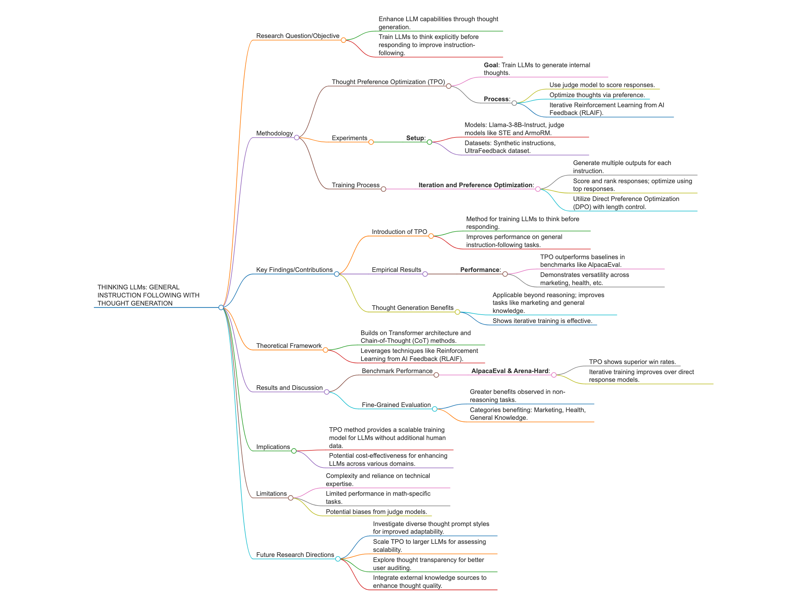

# PoC code for "Thinking LLMs: General Instruction Following with Thought Generation"

Blog post <https://paperwithoutcode.com/thinking-llms-general-instruction-following-with-thought-generation-system-2-on-cot/>

Tianhao Wu, Janice Lan, Weizhe Yuan, Jiantao Jiao, Jason Weston, Sainbayar Sukhbaatar

The research paper "THINKING LLMs: GENERAL INSTRUCTION FOLLOWING WITH THOUGHT GENERATION" introduces Thought Preference Optimization (TPO), a novel methodology for enhancing Large Language Models' (LLMs) instruction-following capabilities by enabling internal thought processes before generating responses. Building on the foundation of Chain-of-Thought (CoT) prompting and System 2 reasoning methods, TPO marks a significant advancement in AI, emphasizing the importance of internal reasoning akin to human thought. By employing a judge model to score responses and optimize underlying thoughts without directly relying on human thought data, the paper innovatively circumvents traditional data-heavy methods, making it a cost-effective and scalable solution. The empirical results highlight the iterative training benefits of TPO, which consistently surpass direct-response baselines across diverse domains like marketing and health, demonstrating its broad applicability and potential for real-world impact. This work paves the way for new training paradigms focusing on cognitive processes within AI, suggesting further exploration into diverse thought prompts, scalability, and integration with external knowledge bases to enhance decision-making transparency and efficacy. The paper is essential for researchers interested in advancing LLM capabilities and exploring future AI system designs that incorporate intricate thought processes. The demo code in this post shows TPO's three key steps: thought generation, response evaluation, and preference optimization, demonstrating improved responses across iterations.

