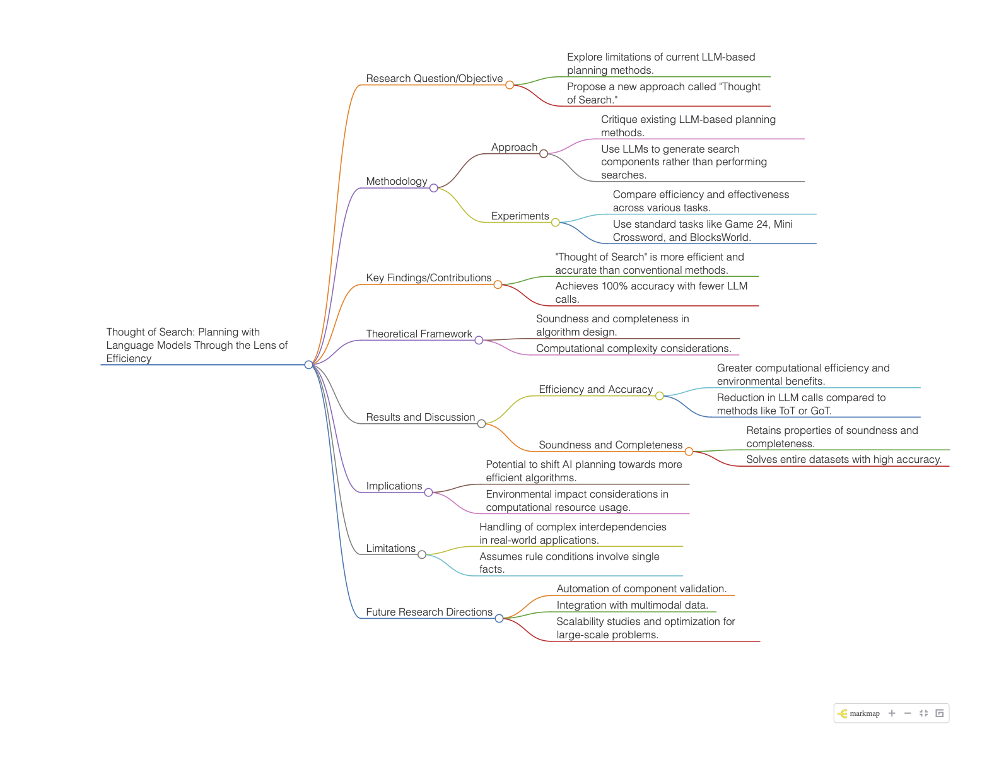

# Code for "Thought of Search: Planning with Language Models Through the Lens of Efficiency"

Michael Katz, Harsha Kokel, Kavitha Srinivas, Shirin Sohrabi

Blog post <https://paperwithoutcode.com/thought-of-search-planning-with-language-models-through-the-lens-of-efficiency/>

The research paper “Thought of Search: Planning with Language Models Through the Lens of Efficiency” introduces a pioneering approach that leverages Large Language Models (LLMs) to revolutionize AI planning methods. Emphasizing soundness, completeness, and efficiency, the authors critique existing LLM-based planning strategies, which often suffer from excessive computational demands and environmental impact. Their novel approach, “Thought of Search,” stands out by generating components of search problems, such as successor functions and goal tests, rather than conducting exhaustive searches. This significantly reduces LLM interactions, achieving 100% accuracy in tasks like the 24 Game—demonstrating both practical efficacy and environmental responsibility by minimizing computing resources. The method’s ability to maintain soundness and completeness positions it as a robust alternative to techniques like Tree of Thoughts and Graph of Thoughts. For researchers, this paper offers foundational insights into improving computational efficiency in AI, potentially guiding the development of sustainable technologies. Future research could explore automating the validation of generated components or extending applications to multimodal data inputs. By tackling both efficiency and ecological concerns, this work propels AI planning toward a more resource-conscious future, making it essential reading for those in the field. The code in this post illustrates the idea with a few classic AI problems and dynamic solution code of successor functions, goal test, and optionally heuristic functions.

