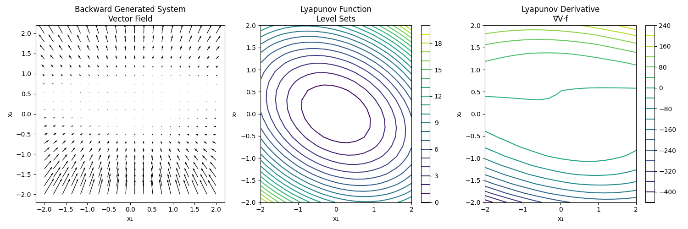
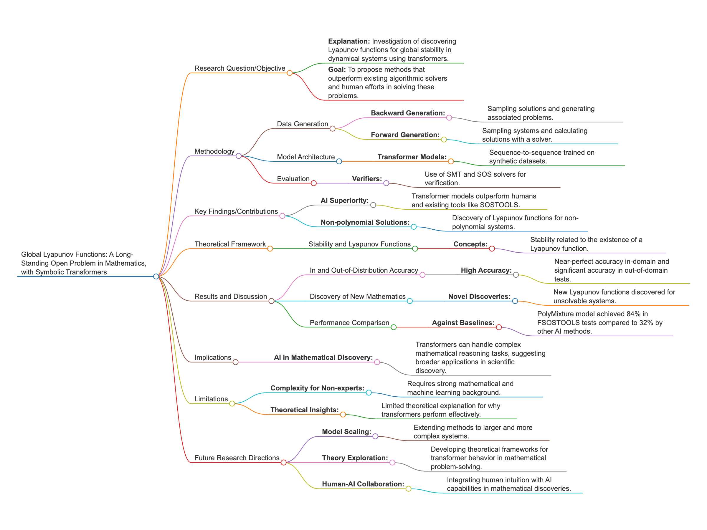

# Demo code for "Global Lyapunov functions: a long-standing open problem in mathematics, with symbolic transformers"

Blog post <https://paperwithoutcode.com/global-lyapunov-functions-a-long-standing-open-problem-in-mathematics-with-symbolic-transformers-ai-for-3-body-problem/>

Alberto Alfarano, François Charton, Amaury Hayat

The paper “Global Lyapunov functions: a long-standing open problem in mathematics, with symbolic transformers” offers a pioneering approach to tackling the complex problem of discovering Lyapunov functions, which play a crucial role in ensuring the global stability of dynamical systems. Highlighting a novel application of AI, the authors employ sequence-to-sequence transformers, framing the challenge as a translation task where a system of equations is translated into its corresponding Lyapunov function. This innovative approach surpasses traditional algorithmic and human methods, particularly in solving both polynomial and non-polynomial systems, thereby showcasing the potential of AI to address complex mathematical reasoning tasks that have eluded conventional solvers. The paper’s use of synthetic datasets, generated through backward and forward methods, is particularly noteworthy. It provides the extensive training data necessary for the model to generalize effectively and identify Lyapunov functions even for previously unsolvable cases. By successfully integrating AI into this domain, the research not only advances the state of symbolic mathematics but also opens avenues for future exploration, such as extending the method to larger, more intricate systems, and integrating AI with human mathematical intuition for synergistic problem-solving. This work marks a significant leap in using AI to expand the limits of mathematical discovery and stability analysis, akin to addressing unresolved challenges like the famous 3-body problem. This post implemented a minimal demo to illustrate the backward and forward data generation, and a very simple Lyapunov transformer for educational purposes.


To run it on a Macbook Pro

```
python lyapunov_training.py --load my_dataset.json --device mps
```

