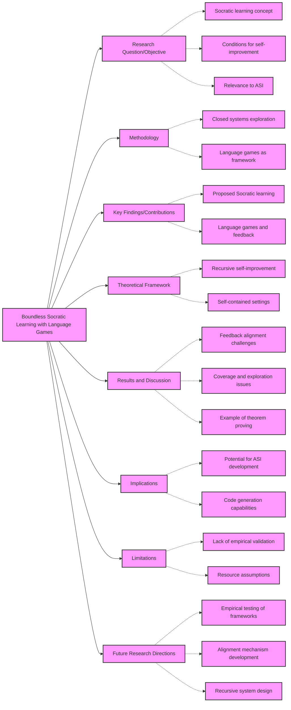

# Summary of 2411.16905

## Interpretive Summary for Researchers and Graduate Students

The paper introduces the novel concept of 'Socratic learning' within closed AI systems, highlighting its potential for recursive self-improvement driven by internal processes rather than external inputs. This theoretical framework proposes that by using overlapping input and output spaces—primarily through language—AI systems could achieve superhuman intelligence autonomously. The author delineates three critical conditions essential for such self-improvement: effective feedback, sufficient coverage, and ample scale. These conditions are strategically discussed through the lens of language games, offering a structured approach to generating diverse data and providing robust feedback mechanisms intrinsic to the system. The paper's exploration of recursive, self-referential systems further posits that AI could evolve by modifying its architecture, a frontier concept that aligns conceptually with recent advancements in reinforcement learning and language models. While the paper is theoretical and lacks empirical validation, its implications for AI development are profound, encouraging future research to focus on empirical testing of these frameworks, particularly through designing scalable language games and ensuring alignment in feedback loops. This work offers valuable insights for researchers interested in the progression toward fully autonomous, self-improving AI systems, and its technical depth makes it a crucial read for those exploring advanced AI architectures and self-referential algorithms.

## Highlights Explained

```markdown
## Highlights Explained

### Socratic Learning in Closed Systems

**Explanation**: Socratic learning is introduced as a form of recursive self-improvement where an AI system can enhance its capabilities within a closed environment without importing new data from the external world. This learning method leverages overlapping input and output spaces, such as language, to propel development internally.

**Significance**: This concept is pivotal as it explores the potential for artificial superhuman intelligence (ASI) to emerge from systems that do not rely on human data, labels, or preferences. It highlights a theoretical path toward ASI where self-improvement is driven purely by the system itself.

**Relation to Existing Work**: Socratic learning builds on the principles of reinforcement learning but extends them by focusing on systems that eventually surpass their initial programming, akin to the path AlphaZero took in mastering games like Chess and Go.

### Necessary Conditions for Self-Improvement

**Explanation**: The paper outlines three criteria essential for self-improvement within closed systems: effective feedback, sufficient coverage, and ample scale. These conditions ensure the system has relevant feedback to guide learning, diverse enough data to prevent collapse, and adequate resources to support expansive growth.

**Significance**: By establishing these conditions, the paper sets a framework to assess and potentially build systems capable of achieving superhuman intelligence through self-driven improvements.

**Relation to Existing Work**: These conditions resonate with Sutton's reinforcement learning concepts, especially the need for scalable and efficient processes that optimize agent behavior over time.

### Language Games as a Framework

**Explanation**: Language games are proposed as a mechanism to facilitate Socratic learning. These games involve scenarios where agents interact using language, receiving feedback through game outcomes to improve over time.

**Significance**: This framework provides a structured approach to generate broad and diverse data intrinsically, facilitating self-improvement within the constraints of a closed system.

**Relation to Existing Work**: Language games align with the ideas of interactive AI systems like multi-agent learning and debate, reflecting the social and dynamic nature of human language through AI.

### Recursive and Self-Referential Systems

**Explanation**: The paper discusses the potential of recursive systems where agents can modify not only their learning inputs but also their internal structures, leading to self-referential enhancements.

**Significance**: This idea represents a frontier in AI development, where agents could evolve more dramatically by altering internal components, potentially breaking current boundaries in AI capabilities.

**Potential Impact**: Modern advancements in language models and code generation tools may make the implementation of self-referential systems more feasible, posing significant implications for future AI development.

### Implications for Code Generation Potential

**Explanation**: The discussion on recursive self-improvement and language games inherently points towards AI’s future in code generation and understanding. Agents operating within these frameworks could produce not just language outputs but code that affects their environment and internals.

**Significance**: This suggests a pathway where AI systems could autonomously generate and refine code, leading to more sophisticated levels of problem-solving and creative outputs.

**Relation to Existing Work**: Current advancements in LLMs and frameworks like InterCode emphasize the growing role of AI in automating code production, indicating a near-future where such capabilities might be standard across AI systems.
```


## Mermaid Mind Map


```

## First Pass

1. **Category**: This paper is a position paper. The author discusses the concept of 'Socratic learning' within closed systems and examines the necessary conditions and frameworks to enable recursive self-improvement.

2. **Context**: The paper is related to ongoing discussions about artificial superhuman intelligence (ASI), recursive self-improvement, and learning frameworks such as reinforcement learning. It references foundational work in AI, reinforcement learning (Sutton, 2018; Sutton, 2019), and recent advancements in language models and AI systems, including AlphaZero and LLMs (Large Language Models).

3. **Correctness**: The assumptions in the paper—such as the conditions required for an agent to improve in a closed system and the applicability of language games as a framework—are well-reasoned, although they remain speculative and theoretical as the paper itself is more about framing and discussing potential developments rather than providing empirical evidence.

4. **Contributions**: The paper's main contributions include proposing the concept of 'Socratic learning' as a form of recursive self-improvement in closed systems and suggesting language games as a framework to implement this form of learning. It outlines the conditions necessary for such systems to thrive and discusses the potential and limitations inherent in pure self-improvement processes.

5. **Clarity**: The paper is well written for its intended purpose as a position paper. It is clear in defining terms, outlining necessary conditions, and discussing theoretical frameworks. However, as it is theoretical in nature, its lack of empirical data might pose a challenge for readers looking for immediate practical applications.

**References**: Some notable references include Sutton's work on reinforcement learning, Chalmers (2024) on sensory grounding, and recent LLM advancements by OpenAI (2023, 2024). Silver et al.'s work on reinforcement learning through self-play and AlphaZero is also mentioned.

## Second Pass

### Second Pass Summary and Analysis:

#### Summary of Main Thrust:
The paper delves into the concept of 'Socratic learning' within closed systems of artificial intelligence (AI), proposing a framework where recursive self-improvement is possible in an agent whose input and output spaces overlap, such as language. This position paper argues that such a system can drive itself towards superhuman intelligence, provided that three conditions are met: effective feedback, sufficient coverage, and ample scale. These conditions are articulated through the lens of language games, drawing from both theoretical ideas and the practical upsurge of language models and AI advancements. The paper is theoretical and is aimed at framing the discussion around the long-term potential of self-improving AI systems without considering current technological constraints.

#### Supporting Evidence and Illustrations:
1. **Figures and Diagrams**: The paper includes a "cartoon depiction" (Fig. 1) illustrating the key definitions and the relationships among a closed system, an agent, and an external observer. This diagram helps visualize the interaction between agent outputs and inputs and illustrates the concept of recursive self-improvement.
   
2. **Example**: The paper provides a hypothetical example of a mathematical theorem-proving system to concretely illustrate how Socratic learning might operate. This system has a verifier, a reward mechanism for proof generation, and showcases how self-improvement could potentially lead to proving complex hypotheses, like the Riemann hypothesis.

3. **Theoretical Framework**: Different aspects of Socratic learning are elaborated through robust theoretical support, drawing parallels with reinforcement learning, language games, and the recent evolution of AI capabilities especially in language processing.

#### Unread References Marked for Further Reading:
1. **Chalmers (2024)** - Discusses sensory grounding in AI, which is pivotal for understanding the context and implications of Socratic learning in non-grounded systems.
2. **Sutton (2018, 2019)** - Foundational work on reinforcement learning, crucial for underpinning the self-improvement discussions.
3. **Silver et al. (2018, 2021)** - Work on self-play and the concept of 'reward is enough,' which potentially aligns with the feedback mechanisms discussed.
4. **Fernando et al. (2023), Bai et al. (2022a)** - References to techniques like meta-prompts and AI-feedback, relevant for semi-autonomous feedback mechanisms.

#### Difficult or Ambiguous Parts:
- **Alignment of Feedback**: The paper touches on a complex issue of aligning internal system feedback with external observer metrics—this remains a high-level theoretical challenge without clear empirical solutions offered.
   
- **Coverage and Exploration**: The requirement for broad data generation and preventing collapsing coverage is discussed, yet implementing this in practical systems remains a challenging task, requiring more nuanced solutions than what is briefly suggested here.

- **Higher-level Recursions and Meta-games**: The section discussing recursive extensions and self-referential systems implies complex recursion within the agent's learning process, demanding a deep understanding of advanced reinforcement learning and AI system design.

### Recommendations:
To gain a more comprehensive understanding of the foundational methods and theories mentioned, reviewing the marked references is recommended. Additionally, exploring recent developments in reinforcement learning and AI feedback systems will provide insight into practical alignment and coverage strategies in closed systems.

## Third Pass

### Detailed Third Pass Analysis

#### 1. Structure of the Paper
The paper is structured as follows:
- **Abstract**: It briefly introduces the core premise of 'Socratic learning' in closed systems and outlines the necessary conditions for recursive self-improvement.
- **Introduction**: This section sets the stage for the concept of self-improving AI, contrasting human-driven and machine-driven advances and emphasizing the importance of Socratic learning within closed systems. It also clarifies the paper is a theoretical exploration, rather than practical or algorithmic development.
- **Definitions**: Offers foundational descriptions of closed systems, agents, and performance metrics, emphasizing the separation of the agent and observer in terms of feedback and evaluation.
- **Three Necessary Conditions for Self-Improvement**: Discusses feedback, coverage, and scale, elaborating on the importance and challenges of each in enabling self-improvement.
- **Socratic Learning**: Defines Socratic learning as recursive self-improvement within language spaces, illustrating its potential via a hypothetical example in mathematical theorem proving.
- **Fundamental Limits of Socratic Learning**: Discusses constraints and challenges inherent in coverage and feedback alignment.
- **Language Games**: Proposes language games as a tool for fulfilling conditions necessary for Socratic learning, exploring multi-agent dynamics and feedback mechanisms.
- **Higher-Level Recursions and Self-Referential Systems**: Explores further recursive aspects and the potential of agents to modify their own internals, thus radically improving their capabilities.
- **Conclusion**: Summarizes the position paper's findings and suggests a direction for future research in open-ended Socratic learning.
- **Acknowledgments and References**: Lists contributors to the discussion and outlines the literature that supports the paper's theoretical framing.

#### 2. Strong and Weak Points
- **Strong Points:**
  - **Conceptual Clarity**: The paper does a commendable job of clearly delineating its theoretical landscape, particularly the definitions and conditions necessary for Socratic learning.
  - **Theoretical Foundation**: Ties the idea of self-improvement to well-established concepts in reinforcement learning and language games, providing a robust theoretical backing.
  - **Use of Illustrative Examples**: The mathematical theorem-proving example serves to concretize abstract ideas about Socratic learning despite its hypothetical nature.

- **Weak Points:**
  - **Lack of Empirical Validation**: Theoretical in nature, the paper lacks empirical data to substantiate claims, making it challenging to assess practical feasibility.
  - **Alignment Assumptions**: Assumes that effective alignment between system feedback and observer intent is generally achievable, which is a significant and unresolved challenge in AI ethics and safety.
  - **Resource Assumptions**: The assumption that computational resources will continue to scale exponentially is optimistic and may not account for physical or economic constraints.

#### 3. Implicit Assumptions
- **Feedback Alignment**: Assumes internal proxies can remain aligned with external observers over time without explicit, ongoing human-in-the-loop correction.
- **Infinite Resource Growth**: Assumes unlimited computational and memory resources will become available, which is speculative.
- **Language Sufficiency**: Presumes language can encapsulate all aspects of cognition needed for AI to achieve superhuman intelligence, which is a debated point in cognitive science.

#### 4. Missing Citations to Relevant Work
- **Grounding Theories**: The paper would benefit from citing more foundational work on symbolic interactionism or theories of knowledge representation that relate to language and cognitive grounding.
- **AI Alignment/Safety**: More recent AI safety and alignment research could provide contemporary perspectives on feedback alignment issues, such as work by OpenAI or DeepMind on safe AI systems.
  
#### 5. Potential Issues with Experimental or Analytical Techniques
- **Lack of Empirical Testing**: Given its theoretical nature, the paper does not present experimental evidence or validation, raising questions about the feasibility of proposed frameworks.
- **Scalability of Language Games**: The notion of scaling language games indefinitely without addressing issues of complexity and computational limits is a gap that future work must address.
- **Recursive Feedback Loops**: Implicit challenges in managing recursive feedback loops and preventing runaway behaviors or misalignment need more detailed exploration.

### Ideas for Future Work
- **Empirical Validation**: Conduct experiments to empirically test the conditions of feedback, coverage, and scale in closed systems.
- **Alignment Mechanisms**: Develop and test frameworks that ensure continual alignment of internal feedback mechanisms with external evaluators.
- **Language Games**: Experiment with language games in diverse domains to test their robustness and efficacy in producing unbounded data and feedback.
- **Recursive System Design**: Investigate practical methods for designing recursive self-referential systems with safe-guards against misalignment or collapse.
